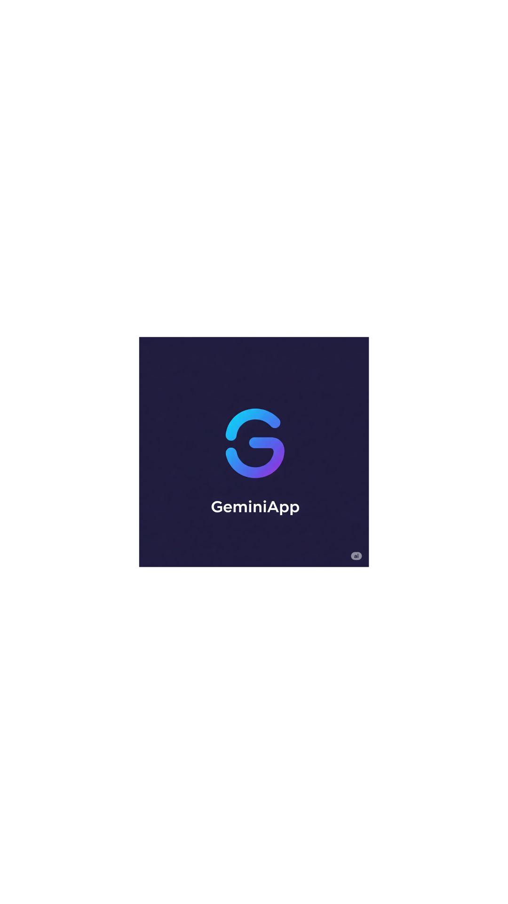

# 🚀 GeminiApp

A beautifully built mobile app using **Expo + React Native** and **Gemini AI integration**.  
This app showcases the power of AI in mobile experiences by leveraging Gemini to provide intelligent responses and interactions.

## ✨ Features

- Gemini AI integration
- Responsive UI
- Cross-platform support
- Lightweight and fast

## 📸 Screenshots

<p float="left">
  
  
  
</p>

## 🛠️ Tech Stack

- Expo
- React Native
- Gemini API
- TypeScript (optional)

## 📦 Setup

```bash
git clone https://github.com/jaferi512/GeminiApp.git
cd your-repo
npm install
npx expo start
